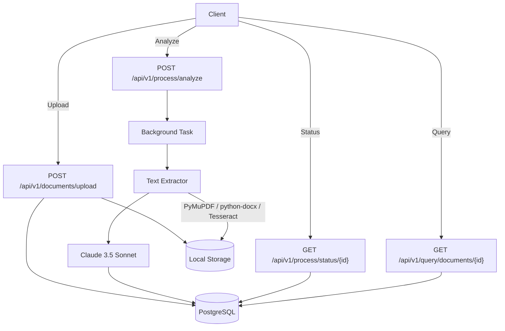

# Document Intelligence API

AI-powered document analysis API built with FastAPI. Upload PDFs, images, and Office documents — get structured summaries, key points, entities, sentiment, and topics via Claude 3.5 Sonnet.

## Features

- **Multi-format extraction** — PDF, DOCX, TXT, PNG, JPG, TIFF via PyMuPDF, python-docx, Tesseract OCR
- **Structured AI analysis** — Summaries, key points, named entities, sentiment classification, topic modeling
- **Async background processing** — Non-blocking document pipeline with status polling
- **API key authentication** — bcrypt-hashed keys with per-key rate limiting
- **Structured logging** — JSON output with correlation IDs for request tracing
- **Prometheus metrics** — Request latency, throughput, error rates, token usage
- **Production-ready** — Docker multi-stage build, non-root user, health checks, graceful shutdown

## Architecture



## API Endpoints

| Method | Endpoint | Description |
|--------|----------|-------------|
| `POST` | `/api/v1/documents/upload` | Upload document (multipart/form-data) |
| `POST` | `/api/v1/process/analyze` | Queue document for analysis |
| `GET` | `/api/v1/process/status/{id}` | Get processing status |
| `GET` | `/api/v1/query/documents` | List documents (paginated) |
| `GET` | `/api/v1/query/documents/{id}` | Get full analysis results |
| `GET` | `/api/v1/query/stats` | Usage statistics |
| `POST` | `/api/v1/auth/keys` | Create new API key |
| `GET` | `/health` | Health check (DB + service) |
| `GET` | `/metrics` | Prometheus metrics |

## Quick Start

### Prerequisites

- Python 3.11+
- PostgreSQL 14+ (or SQLite for development)
- Anthropic API key

### Local Development

```bash
# Clone and install
git clone https://github.com/DavidEscotoDev/doc-intel-api.git
cd doc-intel-api
pip install -r requirements.txt

# Configure environment
cp .env.example .env
# Edit .env with your ANTHROPIC_API_KEY and DATABASE_URL

# Run migrations and start
alembic upgrade head
uvicorn app.main:app --reload
```

### Docker

```bash
# Build and run with PostgreSQL
docker-compose up --build
```

API available at `http://localhost:8000/docs`

## Configuration

All settings via environment variables (`.env`):

| Variable | Description | Default |
|----------|-------------|---------|
| `APP_ENV` | Environment (development/production) | `development` |
| `DATABASE_URL` | PostgreSQL connection string | `sqlite+aiosqlite:///:memory:` |
| `ANTHROPIC_API_KEY` | Anthropic API key | Required |
| `ANTHROPIC_MODEL` | Model to use | `claude-3-5-sonnet-20241022` |
| `API_KEY_PREFIX` | Prefix for generated keys | `di_` |
| `RATE_LIMIT_REQUESTS` | Requests per window | `10` |
| `RATE_LIMIT_WINDOW` | Window in seconds | `60` |
| `MAX_FILE_SIZE_MB` | Max upload size | `50` |
| `LOCAL_STORAGE_PATH` | Upload directory | `/app/data/uploads` |
| `LOG_LEVEL` | Logging level | `INFO` |

## Example Usage

### Create API Key

```bash
curl -X POST http://localhost:8000/api/v1/auth/keys \
  -H "Authorization: Bearer di_admin_key" \
  -H "Content-Type: application/json" \
  -d '{"name": "my-app", "rate_limit": 60}'
```

Response:
```json
{
  "id": "uuid",
  "key": "di_abc123...",
  "name": "my-app",
  "rate_limit": 60,
  "created_at": "2024-01-15T10:30:00Z"
}
```

### Upload Document

```bash
curl -X POST http://localhost:8000/api/v1/documents/upload \
  -H "Authorization: Bearer di_abc123..." \
  -F "file=@report.pdf"
```

### Trigger Analysis

```bash
curl -X POST http://localhost:8000/api/v1/process/analyze \
  -H "Authorization: Bearer di_abc123..." \
  -H "Content-Type: application/json" \
  -d '{"document_id": "uuid-from-upload"}'
```

### Get Results

```bash
curl -X GET http://localhost:8000/api/v1/query/documents/{id} \
  -H "Authorization: Bearer di_abc123..."
```

Response:
```json
{
  "id": "uuid",
  "document_id": "uuid",
  "summary": "Executive summary...",
  "key_points": ["Point 1", "Point 2", "Point 3"],
  "entities": ["Acme Corp", "John Doe", "Q3 2024"],
  "sentiment": "positive",
  "topics": ["financial-report", "quarterly-results"],
  "tokens_used": 1234,
  "model_version": "claude-3-5-sonnet-20241022",
  "processing_time_ms": 2450,
  "created_at": "2024-01-15T10:35:00Z"
}
```

## Project Structure

```
app/
├── main.py                 # FastAPI factory, lifespan, middleware
├── config.py               # Pydantic Settings (env-driven)
├── database.py             # Async SQLAlchemy engine/session
├── exceptions.py           # AppException hierarchy
├── logging.py              # structlog configuration
├── constants.py            # Module-level constants
├── middleware/
│   ├── auth.py             # API key verification
│   ├── rate_limit.py       # In-memory rate limiter
│   └── logging.py          # Request/response logging
├── models/
│   ├── document.py         # Document + analysis (JSON cols)
│   └── api_key.py          # API key with bcrypt hash
├── routes/
│   ├── upload.py           # POST /documents/upload
│   ├── process.py          # POST /process/analyze, GET /status
│   ├── query.py            # GET /documents, /documents/{id}, /stats
│   ├── auth.py             # POST /auth/keys
│   └── health.py           # GET /health, /metrics
├── services/
│   ├── storage.py          # Local file storage
│   ├── extractor.py        # Text extraction (PDF/DOCX/IMG)
│   └── llm.py              # Anthropic client + JSON parsing
├── tasks/
│   └── processor.py        # Background analysis pipeline
├── schemas/                # Pydantic request/response models
└── security/
    └── validation.py       # Filename + content validation
```

## Tech Stack

| Category | Technology |
|----------|------------|
| API Framework | FastAPI 0.109 |
| Database | SQLAlchemy 2.0 (async) + PostgreSQL |
| ORM | SQLAlchemy 2.0 Declarative |
| Migrations | Alembic |
| Auth | API Keys + bcrypt |
| AI/ML | Anthropic SDK (Claude 3.5 Sonnet) |
| Extraction | PyMuPDF, python-docx, Tesseract |
| Logging | structlog (JSON) |
| Metrics | prometheus-client |
| Container | Docker multi-stage |
| Testing | pytest + pytest-asyncio |

## Testing

```bash
# Run all tests
pytest

# With coverage
pytest --cov=app --cov-report=term-missing
```

## Deployment

### Render (Free Tier)

1. Connect GitHub repository
2. Select Blueprint (`render.yaml`)
3. Add `ANTHROPIC_API_KEY` in Environment tab
4. Deploy

### Docker

```bash
docker build -t doc-intel-api .
docker run -p 8000:8000 --env-file .env doc-intel-api
```

### Kubernetes

Helm chart available in `deploy/helm/`

## Security

- API keys bcrypt-hashed (never stored in plaintext)
- Per-key rate limiting (configurable)
- File validation: MIME type, magic bytes, size limits
- Filename sanitization (path traversal prevention)
- Non-root Docker user
- Security headers via middleware
- CORS configurable per environment

## Monitoring

- **Health**: `GET /health` (liveness + readiness)
- **Metrics**: `GET /metrics` (Prometheus format)
- **Logs**: Structured JSON with correlation IDs
- **Tracing**: Correlation ID propagated through middleware

## License

MIT License — see [LICENSE](LICENSE)

## Author

David Escoto — [GitHub](https://github.com/DavidEscotoDev)