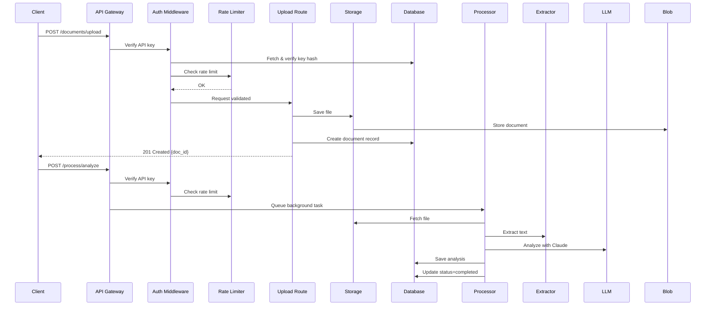
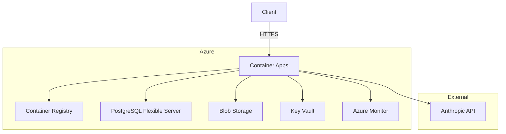

# Document Intelligence API Architecture

```mermaid
graph TB
    Client[Client] -->|HTTPS| API[FastAPI API]
    
    subgraph "API Layer"
        API --> Auth[Auth Middleware]
        API --> RateLimit[Rate Limit Middleware]
        API --> Logging[Request Logging Middleware]
        API --> SecurityHeaders[Security Headers Middleware]
    end
    
    subgraph "Routes"
        Upload[/documents/upload]
        Process[/process/analyze]
        Query[/query/documents]
        AuthRoutes[/auth/keys]
        Health[/health/*]
    end
    
    Auth --> Upload
    Auth --> Process
    Auth --> Query
    Auth --> AuthRoutes
    
    subgraph "Services"
        Storage[Storage Service]
        Extractor[Text Extractor]
        LLM[LLM Service]
        Processor[Document Processor]
    end
    
    Upload --> Storage
    Upload --> DB
    Process --> Processor
    Processor --> Storage
    Processor --> Extractor
    Processor --> LLM
    Processor --> DB
    Query --> DB
    AuthRoutes --> DB
    
    subgraph "Data Layer"
        DB[(PostgreSQL)]
        Blob[Azure Blob Storage]
        KeyVault[Azure Key Vault]
    end
    
    Storage --> Blob
    DB -->|asyncpg| DB
    LLM -->|HTTPS| Anthropic[Anthropic API]
    
    subgraph "Observability"
        OTel[OpenTelemetry]
        Prometheus[Prometheus]
        AzureMonitor[Azure Monitor]
        Structlog[Structured Logging]
    end
    
    API --> OTel
    OTel --> Prometheus
    OTel --> AzureMonitor
    API --> Structlog
    
    subgraph "Background Processing"
        BGTasks[BackgroundTasks]
        Processor -.-> BGTasks
    end
    
    subgraph "Configuration"
        Settings[Settings]
        KeyVault -.-> Settings
    end
    
    classDef azure fill:#0078d4,color:#fff;
    classDef core fill:#2c3e50,color:#fff;
    classDef obs fill:#f39c12,color:#fff;
    classDef ext fill:#8e44ad,color:#fff;
    
    class Blob,KeyVault,AzureMonitor azure;
    class API,Auth,RateLimit,Logging,SecurityHeaders,Upload,Process,Query,AuthRoutes,Health,Storage,Extractor,LLM,Processor,DB core;
    class OTel,Prometheus,Structlog obs;
    class Anthropic ext;
```

## Component Description

| Component | Technology | Purpose |
|-----------|------------|---------|
| **FastAPI API** | FastAPI 0.109 | Async HTTP framework |
| **Auth Middleware** | Custom + bcrypt | API key verification |
| **Rate Limit** | In-memory / Redis | Per-key rate limiting |
| **Storage Service** | Local / Azure Blob | File persistence |
| **Text Extractor** | PyMuPDF, python-docx, Tesseract | Multi-format extraction |
| **LLM Service** | Anthropic Async SDK | Document analysis |
| **PostgreSQL** | asyncpg + SQLAlchemy 2.0 | Async ORM |
| **OpenTelemetry** | OTel SDK | Tracing + metrics |
| **Prometheus** | prometheus-client | Metrics exposition |
| **Structured Logging** | structlog | JSON logs with correlation IDs |

## Request Flow



## Deployment Topology

